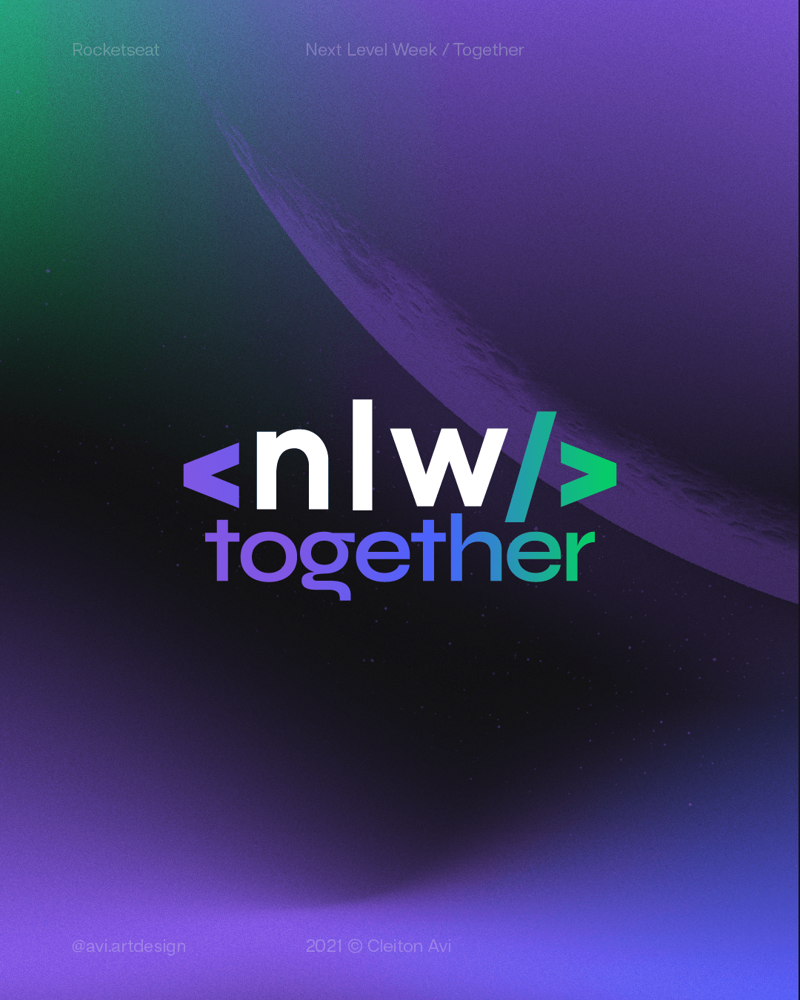

<h1 align="center">
    
</h1>

<h1 align="center">
    
</h1>

<h4 align="center">
  🚀 Next Level Week Together - GamePlay
</h4>

<p align="center">
  

  
  
  <a href="https://github.com/WallysonGalvao/rocketseat-nlw-gameplay/commits/master">
    
  </a>

  <a href="https://github.com/WallysonGalvao/rocketseat-nlw-gameplay/issues">
    
  </a>

  
</p>

<p align="center">
  <a href="#-projeto">Projeto</a>&nbsp;&nbsp;&nbsp;|&nbsp;&nbsp;&nbsp;
  <a href="#-layout">Layout</a>&nbsp;&nbsp;&nbsp;|&nbsp;&nbsp;&nbsp;
  <a href="#rocket-tecnologias">Tecnologias</a>&nbsp;&nbsp;&nbsp;|&nbsp;&nbsp;&nbsp;
  <a href="#rocket-executando">Executando</a>&nbsp;&nbsp;&nbsp;|&nbsp;&nbsp;&nbsp;
  <a href="#memo-licença">Licença</a>
</p>
<br>

## 💻 Projeto

Esse projeto foi desenvolvido durante a Next Level Week Together promovida pela [Rocketseat](https://rocketseat.com.br/).

## 🎨 Layout

Você pode utilizar a seguinte URL para visualizar todas as telas: [Visualizar](https://www.figma.com/file/0kv33XYjvOgvKGKHBaiR07/GamePlay---NLW-Together/duplicate?node-id=58913%3A83)

## :rocket: Tecnologias

Esse projeto foi desenvolvido com as seguintes tecnologias:

- [Typescript](https://www.typescriptlang.org/)
- [React Native](https://reactnative.dev/)
- [Expo](https://expo.io/)

\* Para mais detalhes, veja o **[package.json](./package.json)**

## :notebook: Executando

### Frontend

```bash
# Clone este repositório
$ git clone https://github.com/WallysonGalvao/rocketseat-nlw-gameplay.git

# Acesse a pasta do projeto no seu terminal/cmd
$ cd rocketseat-nlw-gameplay

# Instale as dependências
$ yarn install

# Instale as dependências para iOS
$ cd ios && pod install

# Execute a aplicação
$ yarn android ou yarn ios
```

## :construction: Como contribuir para o projeto

1. Faça um **fork** do projeto.
2. Crie uma nova branch com as suas alterações: `git checkout -b my-awesome-feature`
3. Salve as alterações e crie uma mensagem de commit contando o que você fez: `git commit -m "feature: My awesome feature"`
4. Envie as suas alterações: `git push origin my-awesome-feature`
   > Caso tenha alguma dúvida confira este [guia de como contribuir no GitHub](https://github.com/firstcontributions/first-contributions)

## :memo: Licença

Esse projeto está sob a licença MIT. Veja o arquivo [LICENSE](LICENSE.md) para mais detalhes.

---

Feito com horas em frente ao :computer: por [Wallyson Galvão](https://www.linkedin.com/in/wallyson-galvao/)
